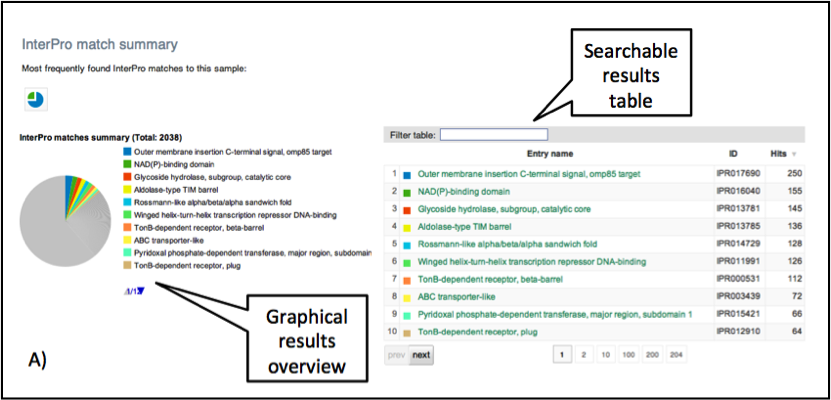

#Functional Data Analysis

##Key Learning Outcomes
---------------------

After completing this module the trainee should be able to:

-   Understand how EMG provides functional analysis of metagenomic data sets

-   Know where to find and how to interpret analysis results for samples on the EMG website

-   Know how to download the raw sample data and analysis results for use with 3rd party visualisation and statistical analysis packages

##Resources You’ll be Using
-------------------------

### Tools Used

STAMP :  
http://kiwi.cs.dal.ca/Software/STAMP

###Useful Links
------------

EBI Metagenomics resource (EMG) :   
    [www.ebi.ac.uk/metagenomics/](www.ebi.ac.uk/metagenomics/)

##Introduction
------------

The EBI Metagenomics resource (EMG) provides functional analysis of
predicted coding sequences (pCDS) from metagenomic data sets using the
InterPro database. InterPro is a sequence analysis resource that
predicts protein family membership, along with the presence of important
domains and sites. It does this by combining predictive models known as
protein signatures from a number of different databases into a single
searchable resource. InterPro curators manually integrate the different
signatures, providing names and descriptive abstracts and, whenever
possible, adding Gene Ontology (GO) terms. Links are also provided to
pathway databases, such as KEGG, MetaCyc and Reactome, and to structural
resources, such as SCOP, CATH and PDB.

### What are protein signatures?

Protein signatures are obtained by modelling the conservation of amino
acids at specific positions within a group of related proteins (i.e., a
protein family), or within the domains/sites shared by a group of
proteins. InterPro’s different member databases use different
computational methods to produce protein signatures, and they each have
their own particular focus of interest: structural and/or functional
domains, protein families, or protein features, such as active sites or
binding sites (see Figure 1).

### Figures

Only a subset of the InterPro member databases are used by EMG: Gene3D,
TIGRFAMs, Pfam, PRINTS and PROSITE patterns. These databases were
selected since, together, they provide both high coverage and offer
detailed functional analysis, and have underlying algorithms that can
cope with the vast amounts of fragmentary sequence data found in
metagenomic datasets.

### Assigning functional information to metagenomic sequences

Whilst InterPro matches to metagenomic sequence sets are informative in
their own right, EMG offers an additional type of analysis in the form
of Gene Ontology (GO) terms. The Gene Ontology is made up of 3
structured controlled vocabularies that describe gene products in terms
of their associated biological processes, cellular components and
molecular functions in a species-independent manner. By using GO terms,
scientists working on different species or using different databases can
compare datasets, since they have a precisely defined name and meaning
for a particular concept. Terms in the Gene Ontology are ordered into
hierarchies, with less specific terms towards the top and more specific
terms towards the bottom (see Figure 2).

An example of GO terms organised into a hierarchy, with terms becoming less specific as the hierarchy is ascended (e.g., alpha-tubulin binding
is a type of cytoskeletal binding, which is a type of protein binding).
Note that a GO term can have more than one parent term. The Gene
Ontology also allows for different types of relationships between terms
(such as ‘has part of’ or ‘regulates’). The EMG analysis pipeline only
uses the straightforward ‘is a’
relationships.

More information about the GO project can be found
<http://www.geneontology.org/GO.doc.shtml>

As part of the EMG analysis pipeline, GO terms for molecular function,
biological process and cellular component are associated to pCDS in a
sample via the InterPro2GO mapping service. This works as follows:
InterPro entries are given GO terms by curators if the terms can be
accurately applied to all of the proteins matching that entry. Sequences
searched against InterPro are then associated with GO terms by virtue of
the entries they match - a protein that matches one InterPro entry with
the GO term ‘kinase activity’ and another InterPro entry with the GO
term ‘zinc ion binding’ will be annotated with both GO terms.

### Finding functional information about samples on the EMG website

Functional analysis of samples within projects on the EMG website
[www.ebi.ac.uk/metagenomics/](www.ebi.ac.uk/metagenomics/) can be
accessed by clicking on the Functional Analysis tab found toward the top
of any sample page (see Figure 3 below).

A Functional analysis tab can be found towards the top of each sample .page

Clicking on this tab brings up a page displaying sequence features (the
number of reads with pCDS, the number of pCDS with InterPro matches,
etc), InterPro match information and GO term annotation for the sample,
as shown in Figure 4 and 5 below.

Functional analysis of metagenomics data, as shown on the EMG website.

InterPro match information for the predicted coding sequences in the sample is shown. The number of InterPro matches are displayed graphically, and as a table that has a text search facility.

The GO terms predicted for the sample are displayed. Different
graphical representations are available, and can be selected by clicking
on the ‘Switch view’
icons.

The Gene Ontology terms displayed graphically on the web site have been
‘slimmed’ with a special GO slim developed for metagenomic data sets. GO
slims are cut-down versions of the Gene Ontology, containing a subset of
the terms in the whole GO. They give a broad overview of the ontology
content without the detail of the specific fine-grained terms.

The full data sets used to generate both the InterPro and GO overview
charts, along with a host of additional data (processed reads, pCDS,
reads encoding 16S rRNAs, taxonomic analyses, etc) can be downloaded for
further analysis by clicking the Download tab, found towards the top of
the page (see Figure 6).

Each sample has a download tab, where the full set of sequences,
analyses, summaries and raw data can be
downloaded.

##Practical
---------

### Part 1 – Browsing analysed data via the EMG website

Open the Metagenomics Portal homepage in a web browser
https://www.ebi.ac.uk/metagenomics/.

From the Projects list click the ‘Projects’ tab, or ‘View all projects’,
find and click on HOT station, Central North Pacific Gyre, ALOH. You
should now have a Project overview page describing the project, related
publications, and links to the samples that the project contains.

Question 1: What publications are associated with this study?

Scroll down to Associated Samples and open the HOT Station ALOHA, 25 m
sample. You should now have a Sample Overview page, describing various
meta-data associated with the sample, such as the geographic location
from which it was isolated, its collection date, and so on.

Question 2: What is the latitude, longitude and depth at which the
sample was collected?

Question 3: What geographic location does this correspond to?

Question 4: What environmental ontology (ENVO) identifer and name has
the sample material been annotated with?

Click on the ‘Download’ tab. Right click the file labelled ‘Predicted
CDS (FASTA)’ link, and save this file to your desktop. Find the file,
and either double click on it to open it, or examine it using ‘less’ by
typing the following commands in a terminal window:

    cd ~/Desktop
    less HOT_Station_ALOHA,_25m_depth_pCDS.faa

Have a look at one or two of the many sequences it contains. We will
look at the analysis results for this entire batch of sequences,
displayed on the EMG website, in a moment. First, we will attempt
analyse just one of the predicted coding sequences using InterPro (the
analysis results on the EMG website summarise these kind of results for
tens or hundreds of thousands of sequences).

In a new tab or window, open your web browser and navigate to
<http://www.ebi.ac.uk/interpro/>. Copy and paste the following sequence
into the text box on the InterPro home page where it says ‘Analyse your
sequence’:

    >SRR010898.122503_1_115_+
    ENNQEIKIIRNYINEFNLTGFIVGIPLDEKGQMTNQAI

Press Search and wait for your results. Your sequence will be run
through the InterProScan analysis software, which attempts to match it
against all of the different signatures in the InterProScan database.

Question 5: What feature does InterProScan predict your sequence to
contain?

Clicking on the InterPro entry name or IPR accession number will take
you to the InterPro entry page for your result, where more information
can be found.

Question 6: What GO terms is the feature associated with?

Return to the sample page for HOT station, Central North Pacific Gyre,
ALOH 25 m.

Now we are going to look at the functional analysis results for all of
the pCDS in the sample. First, we will find the number of sequences that
made it through to the functional analysis section of the pipeline.

Click on the Quality control tab. This page displays a series of charts,
showing how many sequences passed each quality control step, how many
reads were left after clustering, and so on.

Question 7: After all of the quality filtering steps are complete, how
many reads were submitted for analysis by the pipeline?

Next, we will look at the results of the functional predictions for the
pCDS. These can be found under the Functional analysis tab.

Click on the Functional analysis tab and examine the InterPro match
section. The top part of this page shows a sequence feature summary,
showing the number of reads with predicted coding sequences (pCDS), the
number of pCDS with InterPro matches, etc.

Question 8: How many of the reads that passed the quality control stage
had predicted coding sequences (pCDS)?

Question 9: How many pCDS have InterProScan hits?

Scroll down the page to the InterPro match summary section

Question 10: How many different InterPro entries were matched by the
pCDS?

Question 11: Why is this figure different to the number of pCDS that
have InterProScan hits?

Next we will examine the GO terms predicted by InterPro for the pCDS in
the sample.

Scroll down to the GO term annotation section of the page and examine
the 3 bar charts, which correspond to the 3 different components of the
Gene Ontology.

Question 12: What are the top 3 biological process terms predicted for
the pCDS from the sample?

Selecting the pie chart representation of GO terms makes it easier to
visualise the data to find the answer.

Now we will look at the taxonomic analysis for this sample.

Click on the Taxonomy Analysis tab and examine the phylum composition
graph and table.

Question 13: How many different OTUs were found in this sample?

Question 14: What are the top 3 phyla in the sample?

Select the Krona chart view of the data icon. This brings up an
interactive chart that can be used to analyse data at different
taxonomic ranks.

Question 15: What proportion of cyanobacteria in this sample are made up
of Synechococcaceae?

Now we will compare these analyses with those for a sample taken at 500
m from the same geographical location.

In a new tab or window, find and open the HOT station, Central North
Pacific Gyre, ALOH project page again. Select the sample HOT Station
ALOHA, 500m and examine the information under the Functional analysis
tabs. Question 16: How many pCDS were in this sample? Question 17: How
many of the pCDSs have an InterPro match? Question 18: How many
different InterPro entries are matched by this sample? Question 19: Are
these figures broadly comparable to the ones for the 25 m sample?

Scroll to the bottom of the page and examine the GO term annotation for
the day 500 m sample.

Question 20: Are there visible differences between the GO terms for this
sample and the 25 m sample? Could there be any biological explanation
for this?

Selecting the bar chart representation of GO terms makes it easier to
compare different data sets.

Return to the HOT station project page and open the taxonomy analysis
results for all 4 of the samples, each in a new window.

Question 21: How does the taxonomic composition change at different
ocean sampling depths? Are any trends in the data consistent with your
answer to question 18?

### Part 2 - Analysing EMG data using STAMP

Whilst EMG does not currently support direct comparison of multiple
samples, it is possible to download the underlying data for use with
other visualisation and/or statistical analysis tools, such as STAMP
(Statistical Analysis of Metagenomic Profiles:
<http://kiwi.cs.dal.ca/Software/STAMP>. The Downloads tab for a given
sample lists the files with the necessary data, although a slight amount
of data wrangling is usually required to reformat files, etc.

We are going perform a detailed comparison of the GO slimmed biological
process results for the samples at 25 m and 500 m using STAMP. To do
this, open the HOT station, Central North Pacific Gyre, ALOH project
page again. Select the sample HOT Station ALOHA, 25 m study and download
the GO slim annotation (CSV) file from the download tab. Repeat this for
the HOT Station ALOHA, 500 m study.

You should now have the following 2 files in your downloads folder:
HOT\_Station\_ALOHA,\_25m\_depth\_GO\_slim.csv
HOT\_Station\_ALOHA,\_500m\_depth,\_MG\_GO\_slim.csv.txt (don’t worry
about the fact the file names are constructed slightly differently –
this is an inconsistency on our web site that needs to be corrected!)

Drag or copy these files to your desktop, and then launch a terminal
window, so that you can manipulate the files on the command line.

Navigate to the Desktop directory by typing ‘cd \~/Desktop/’ Next, type
‘ls’ to make sure you can see the files, and take a look at their
contents using the ‘less’ command.

First we are going to wrangle data from the 25 m sample, using a mixture
of ‘grep’ to pull out the lines containing the phrase
‘biological\_process’ and ‘awk’ to split up and reorder the fields.

awk is a text-processing language that is useful for extracting or
transforming documents and reformatting text. You can find out more
about it here: <http://www.gnu.org/software/gawk/manual/gawk.html>

Enter the following command (all on one line):

    grep 'biological_process'  HOT_Station_ALOHA,_25m_depth_GO_slim.csv  | awk -F" '{print \$6 "\t" \$4 "\t" \$8 }'  >  biological_process_25m.txt

This should produce a new file called ‘biological\_process\_26m.txt’.
Use ‘less’ to examine this file.

Question 22: What are the differences between this file and the
HOT\_Station\_ALOHA,\_25m\_depth\_GO\_slim.csv file?

Next, we are going to add the biological process data from the 500 m
sample to this file. Once again, will use ‘grep’ to pull out the
relevant lines in the source file, ‘awk’ to process the lines and output
the correct fields, and ‘paste’ to merge the data with the contents of
the file we produced above.

Enter the following command (all on one line):

    grep 'biological_process' HOT_Station_ALOHA,_500m_depth,_MG_GO_slim.csv | awk -F"{}" '{print \$8 }' | paste biological_process_25m.txt - > biological_process_25mvs500m.txt

This should create another new file, this time called
‘biological\_process\_25mvs500m.txt’. Use ‘less’ to examine this file.

Question 23: What is the difference between this file and the
biological\_process\_25m.txt file?

Finally, we need to add a simple header to the file, so that STAMP can
process it properly. To do this, we could open the file and add the
header manually, but here we will do it on the command line using the
‘printf’ command to write the header, ‘cat’ to print the contents of the
file, and directing the output to a new file with the ‘&gt;’ operator.

Enter the following command (all on one line):

    printf "Classification\tSubclassification\t25m\t500m\n" | cat - biological_process_25mvs500m.txt > biological_process_25mvs500m.spf

This command should have produced a third file called
‘biological\_process\_25mvs500m.spf’ that STAMP can read.

To launch STAMP, type STAMP in the terminal, hit the enter/return key, a
graphical interface will then appear. Load the
biological\_process\_25mvs500m.spf file into STAMP (you will need to set
‘Profile level’ to ‘Subclassification’ and select ‘Two samples’ from the
tabs on the left hand side of the page to view the file once it is
loaded). Try experimenting with different plot types and statistical
tests.

Question 24: Are there any observable differences in biological process
GO terms between the 2 samples?

For your convenience, three files containing the HOT Station GO term
results for all 3 branches of the Gene Ontology (molecular function,
biological process and cellular component) at each sample depth, and a
corresponding metadata file have been pre-generated and formatted for
use with STAMP.

These are located in the /Desktop/InterproTutorial/
folder on the desktop (filenames: HOT\_Station\_ALOHA\_bp.spf,
HOT\_Station\_ALOHA\_mf.spf, HOT\_Station\_ALOHA\_cc.spf and
HOT\_Station\_ALOHA\_metadata.tsv).

Try loading these files into STAMP, as you did with the previous file,
and exploring the results. You can select different samples to compare
(25, 75, 125 and 500 m) using the sample 1 and sample 2 drop down menus.
You can now also use the Multiple Groups tab and explore some of its
options.

Question 25: What trends can you identify in the molecular function,
biological process and cellular component GO terms across the different
sampling depths?
