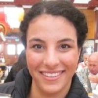
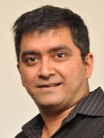
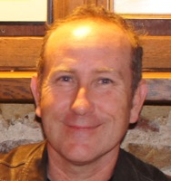
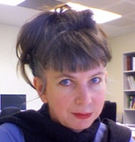
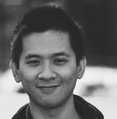
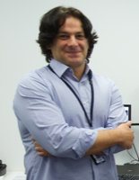
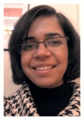
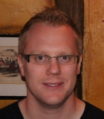

<!--[image](images/generic.jpg) **NAME**, Position, Affiliation-->
 **Dr. Dan Andrews** Bioinformatics Fellow, John Curtin School of Medical Research, Australian National University, Canberra   

 **Ms. Katherine Champ** Workshop Coordinator, Project Officer, Bioplatform Autralia Ltd.  

 **Dr. Zhiliang Chen** Postdoctoral Research Associate, The University of New South Wales (UNSW), Sydney  

 **Dr. Susan Corley** Postdoctoral Research Associate, The University of New South Wales (UNSW), Sydney  

 **Dr. Nandan Deshpande** Postdoctoral Research Associate, The University of New South Wales (UNSW), Sydney  

 **Dr. Konsta Duesing** Research Team Leader - Statistics & Bioinformatics, CSIRO Animal, Food and Health Science, Sydney  

 **Dr. Matthew Field** Senior Research Fellow, Australian National University/James Cook University, Cairns

 **Dr. Velimir Gayevskiy** Translational Bioinformatics Officer, KCCG, Garvan Institute of Medical Research NSW  

 **Paul Greenfield** Principal Experimental Scientist, CSIRO, Sydney  

 **Dr. Xi (Sean) Li** The Australian National University, Canberra  

 **Dr. Annette McGrath** Principal Research Scientist, Team Leader, Life Science Informatics DATA61, CSIRO, Canberra  

 **Mr. Sean McWilliam** Bioinformatics Analyst, CSIRO Agriculture, Brisbane  

 **Dr. Philippe Moncuquet** Research Project Officer, Cotton Disease Markers, CSIRO, Canberra

 **Dr. Paula Moolhuijzen** Bioinformatics Analyst, Centre for Crop Disease Management, Curtin University, Perth  

 **Dr. Ann-Marie Patch** Senior Research Officer, Medical Genomics QIMR Berghofer Medical Research Institute, Brisbane  

 **Dr. Gayle Philip** Research Fellow (Bioinformatics), Melbourne Bioinformatics, Carlton, Melbourne  

 **Mr. Jerico Revote** Software Developer Monash eResearch Centre, Monash University, Clayton Melbourne  

 **A/Prof. Torsten Seemann** Lead Bioinformatician, Melbourne Bioinformatics and MDU-PHL, The University of Melbourne, VIC  

 **Dr Anna Syme** Bioinformatician, Melbourne Bioinformatics, Melbourne  

 **Dr. Erdahl Teber** Senior Research Officer (Bioinformatics), Children Medical Research Institute, Kids Cancer Alliance, University of Sydney, Sydney  

 **Dr. Sonika Tyagi** Bioinformatics Supervisor, Australian Genome Research Facility Ltd, The Walter and Eliza Hall Institute, Melbourne   

 **Dr. Nathan S. Watson-Haigh** Research Fellow in Bioinformatics, The Australian Centre for Plant Functional Genomics (ACPFG), Adelaide  
